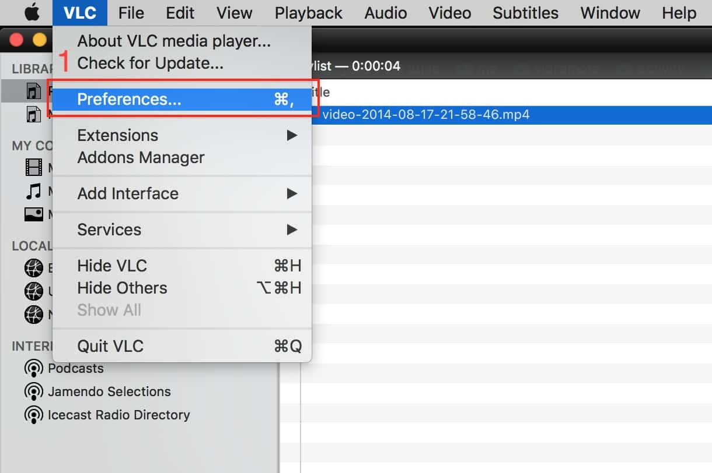
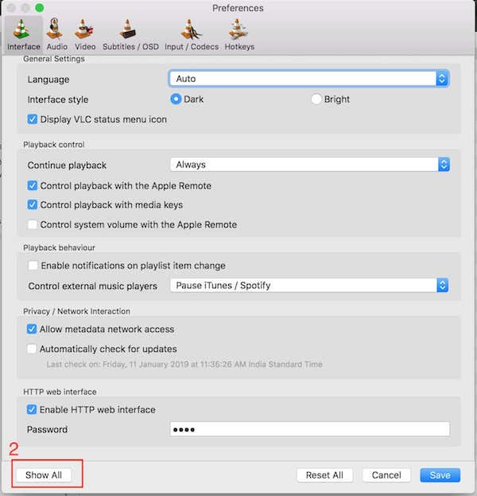
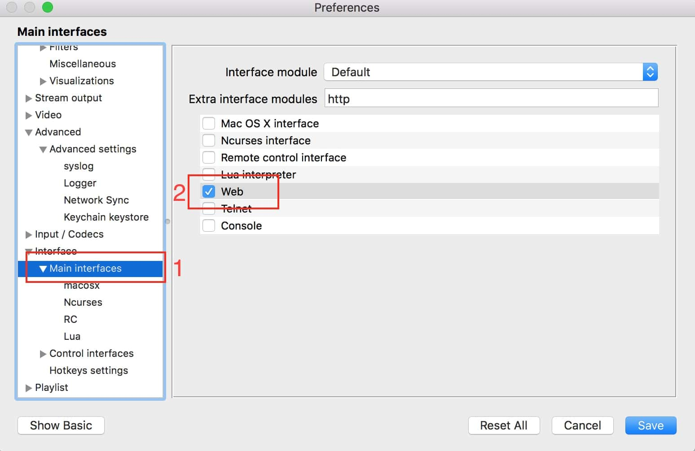
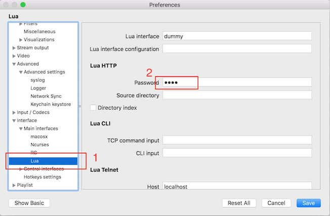
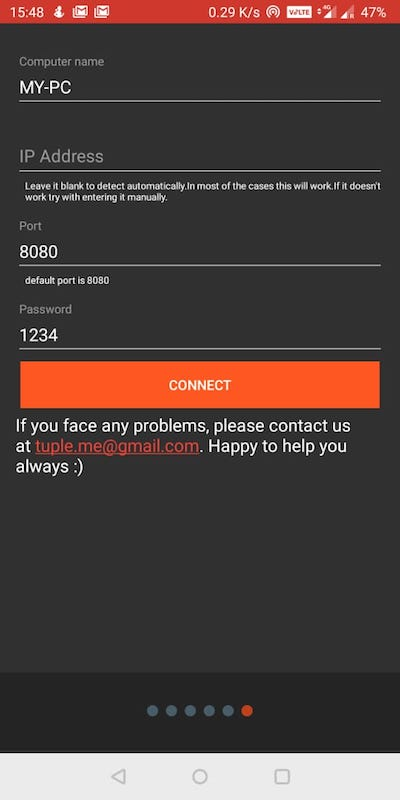

:::note
Download android app from  <a href="https://play.google.com/store/apps/details?id=tuple.me.vlcremote&hl=en_IN" target="_blank">here</a>

Download VLC media player from <a href="https://www.videolan.org/vlc/download-macosx.html" target="_blank">here</a>
:::

:::important

Make sure your phone and computer (or laptop) connected to same WiFi network or your computer (or laptop) connected to phone's hotspot

:::

##### Step 1:

click on __Preferences__(1) in VLC menu

##### Step 2:

click on __Interface__(1) and click on __Show All__(2) at the bottom

##### Step 3:

click on __Main Interfaces__(1) and check __Web__(2) option.

##### Step 4:

click on __Lua__(1) option and set some password in the __Password field__(2) under __Lua HTTP__ menu, say __1234__ and note down the password. we will use this password later.

##### Step 5:

Save and restart VLC and play any video/audio in that.

Save and restart VLC and play any video/audio in that.

##### Step 6:

1. __Computer name:__ give some name for your PC.
2. __IP Address:__ mostly it will detect automatically.
3. __Port:__ default is 8080. don't change it unless you have changed while installing VLC.
4. __Password:__ enter the password that you have given in step 4 and click on connect.
5. If you can't connect, try entering IP address manually and click on connect. To find IP address, follow the instructions [here](find_ip_address.md#mac).

:::tip

If you have configured the app successfully, please read [the tips and tricks.](tips_and_tricks_menus.md)

:::