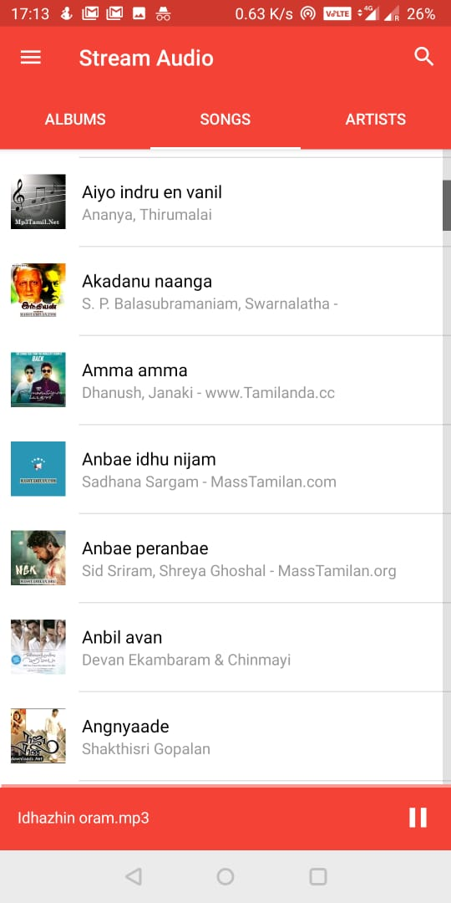

> This menu lets you stream audio/mp3 files in your phone to VLC player in your computer

  

    </img>
  

  

    <ul>
      <li><b>Album</b> tab categorizes songs by album.</li>
      <li><b>Artists</b> tab categorizes songs by artists.</li>
      <li><b>Songs</b> tab lists all the songs in your phone</li>
      <li>Click on any song to stream the song to PC.</li>
       <li>Use the search bar to find audios easily</li>
    </ul>
  

